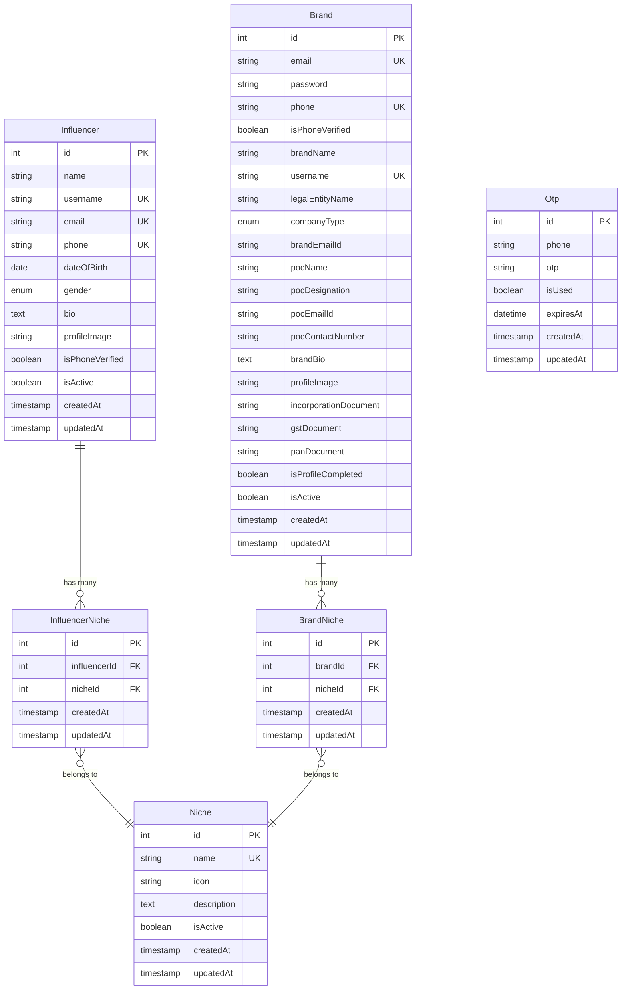

# Database Module

The Database module manages PostgreSQL database connections, model definitions, and data relationships for the Collabkaroo platform.

## Overview

This module provides centralized database configuration using Sequelize ORM with TypeScript support, ensuring type-safe database operations and robust data modeling.

## Features

### 🗄️ Database Configuration
- **PostgreSQL Integration**: Production-ready database setup
- **Sequelize ORM**: Type-safe database operations
- **Connection Pooling**: Efficient database connection management
- **Auto-sync**: Automatic model synchronization (development only)

### 📋 Model Management
- **User Models**: Influencer and Brand entities
- **Content Models**: Niche categories and associations
- **Authentication Models**: OTP and session management
- **Junction Tables**: Many-to-many relationships

## Architecture

```
database/
├── postgres.db.ts              # Main database configuration
├── seeders/                    # Database seeders
│   └── niche.seeder.ts        # Niche categories seeder
└── seed.controller.ts          # Seeder controller
```

## Database Schema

### Core Tables

#### Users
- **influencers** - Influencer profiles and authentication
- **brands** - Brand profiles and business information

#### Content & Categories
- **niches** - Content categories (Fashion, Beauty, Food, etc.)
- **influencer_niches** - Influencer-niche associations
- **brand_niches** - Brand-niche associations

#### Authentication
- **otps** - Phone verification codes and tracking

### Entity Relationships



## Configuration

### Environment Variables
```env
# Database Configuration
POSTGRES_HOST=localhost
POSTGRES_PORT=5432
POSTGRES_USER=postgres
POSTGRES_PASSWORD=your_password
POSTGRES_DB=incollab_db

# Application Environment
NODE_ENV=development|staging|production
```

### Database Connection
```typescript
// Automatic configuration based on environment
SequelizeModule.forRootAsync({
  imports: [ConfigModule],
  inject: [ConfigService],
  useFactory: async (config: ConfigService) => ({
    dialect: "postgres",
    host: config.get<string>("POSTGRES_HOST") || "localhost",
    port: Number(config.get<string>("POSTGRES_PORT")) || 5432,
    username: config.get<string>("POSTGRES_USER") || "postgres",
    password: config.get<string>("POSTGRES_PASSWORD") || "root",
    database: config.get<string>("POSTGRES_DB") || "incollab_db",
    models: [Influencer, Brand, Niche, Otp, InfluencerNiche, BrandNiche],
    autoLoadModels: true,
    synchronize: process.env.NODE_ENV !== 'production',
    logging: process.env.NODE_ENV === 'development',
  }),
})
```

## Models

### Model Definitions

#### Influencer Model
```typescript
@Table({ tableName: 'influencers', timestamps: true })
export class Influencer extends Model<Influencer, InfluencerCreationAttributes> {
  @PrimaryKey
  @AutoIncrement
  @Column(DataType.INTEGER)
  declare id: number;

  @Column({ type: DataType.STRING, allowNull: false })
  name: string;

  @Column({ type: DataType.STRING, allowNull: false, unique: true })
  username: string;

  // ... additional fields
  
  @BelongsToMany(() => Niche, () => InfluencerNiche)
  niches: Niche[];
}
```

#### Brand Model
```typescript
@Table({ tableName: 'brands', timestamps: true })
export class Brand extends Model<Brand, BrandCreationAttributes> {
  @PrimaryKey
  @AutoIncrement
  @Column(DataType.INTEGER)
  declare id: number;

  @Column({ type: DataType.STRING, allowNull: false, unique: true })
  email: string;

  // ... additional fields
  
  @BelongsToMany(() => Niche, () => BrandNiche)
  niches: Niche[];
}
```

### Type Safety

All models include TypeScript interfaces for creation attributes:

```typescript
export interface InfluencerCreationAttributes {
  name: string;
  username: string;
  email: string;
  phone: string;
  dateOfBirth?: string;
  gender?: string;
  bio?: string;
  profileImage?: string;
  isPhoneVerified?: boolean;
  isActive?: boolean;
}
```

## Database Operations

### Connection Management
- Automatic connection pooling
- Health check endpoints
- Graceful shutdown handling
- Connection retry logic

### Query Optimization
- Proper indexing on foreign keys
- Eager loading for associations
- Query result caching where appropriate
- N+1 query prevention

## Seeders

### Niche Seeder
Pre-populates content categories:

```typescript
const niches = [
  { name: 'Fashion', icon: '👗', description: 'Fashion, style, and clothing content' },
  { name: 'Beauty', icon: '💄', description: 'Beauty, makeup, and skincare content' },
  { name: 'Food', icon: '🍽️', description: 'Food, cooking, and culinary content' },
  // ... more categories
];
```

### Running Seeders
```bash
# Seed all data
npm run db:seed

# Or via API endpoint
POST /seed/niches
```

## Migrations

### Development Workflow
```bash
# Create new migration
npx sequelize-cli migration:generate --name add-new-field

# Run migrations
npm run migration:run

# Rollback migration
npm run migration:undo
```

### Production Deployment
- Always run migrations before application deployment
- Backup database before major schema changes
- Test migrations on staging environment first

## Performance Optimization

### Indexing Strategy
- Primary keys (automatic)
- Foreign keys (InfluencerNiche, BrandNiche)
- Unique constraints (email, username, phone)
- Composite indexes for junction tables

### Query Optimization
```typescript
// Good: Include associated data efficiently
const influencer = await this.influencerModel.findByPk(id, {
  include: [
    {
      model: Niche,
      through: { attributes: [] }, // Exclude junction table data
    },
  ],
});

// Avoid: N+1 queries
// const niches = await Promise.all(
//   influencer.nicheIds.map(id => this.nicheModel.findByPk(id))
// );
```

## Error Handling

### Database Errors
- Connection timeout handling
- Constraint violation management
- Transaction rollback on failures
- Graceful degradation strategies

### Common Error Scenarios
```typescript
try {
  await this.influencerModel.create(data);
} catch (error) {
  if (error.name === 'SequelizeUniqueConstraintError') {
    throw new ConflictException('Username already exists');
  }
  if (error.name === 'SequelizeValidationError') {
    throw new BadRequestException('Invalid data provided');
  }
  throw new InternalServerErrorException('Database operation failed');
}
```

## Monitoring & Logging

### Query Logging
- Development: Enabled for debugging
- Production: Disabled for performance
- Staging: Configurable based on needs

### Performance Metrics
- Connection pool utilization
- Query execution times
- Error rates and patterns
- Database size and growth metrics

## Security Best Practices

### Data Protection
- No sensitive data in logs
- Proper field encryption for PII
- SQL injection prevention via ORM
- Input validation at model level

### Access Control
- Database user with minimal privileges
- Connection string security
- Network-level access restrictions
- Regular security updates

## Backup & Recovery

### Backup Strategy
- Daily automated backups
- Point-in-time recovery capability
- Cross-region backup replication
- Regular restore testing

### Recovery Procedures
```bash
# Create backup
pg_dump -h localhost -U postgres incollab_db > backup.sql

# Restore from backup
psql -h localhost -U postgres -d incollab_db < backup.sql
```

## Development Guidelines

### Model Creation Checklist
- [ ] Define TypeScript interfaces
- [ ] Add proper validation decorators
- [ ] Include timestamp columns
- [ ] Set up associations correctly
- [ ] Add appropriate indexes
- [ ] Write creation attributes interface

### Best Practices
- Use transactions for multi-table operations
- Implement proper error handling
- Add comprehensive model validation
- Use eager loading judiciously
- Keep queries optimized and indexed
- Document complex database relationships

## Troubleshooting

### Common Issues

**Connection Timeout**
```typescript
// Check connection configuration
const sequelize = new Sequelize(connectionString, {
  pool: {
    max: 5,
    min: 0,
    acquire: 30000,
    idle: 10000
  }
});
```

**Migration Failures**
- Check database user permissions
- Verify migration file syntax
- Ensure proper rollback procedures
- Test on development database first

**Performance Issues**
- Enable query logging to identify slow queries
- Check for missing indexes
- Analyze query execution plans
- Consider connection pooling settings